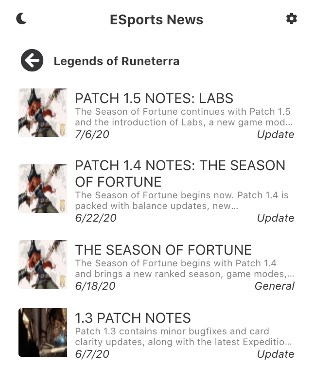
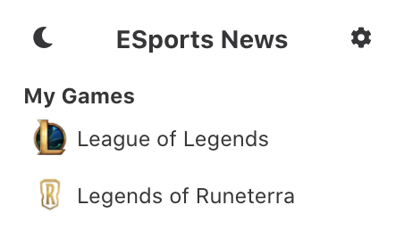

# Official Game News

A chrome extension that allows users to select from a list of video games and get notifications of recent news or patch notes from their respective official sites. 

 
To contribute to the extension, make your changes in the extension directory and then run `npm run build`. In the chrome://extensions/ browser, click on load unpacked and then upload the build folder. To contribute to the server, make your changes in the server directory and run `tsc` to compile the typescript and then `npm start` to start the server locally. 
 
Create a new issue in the respository for any bugs or feature request. Feature requests should be formatted with !Feature.
